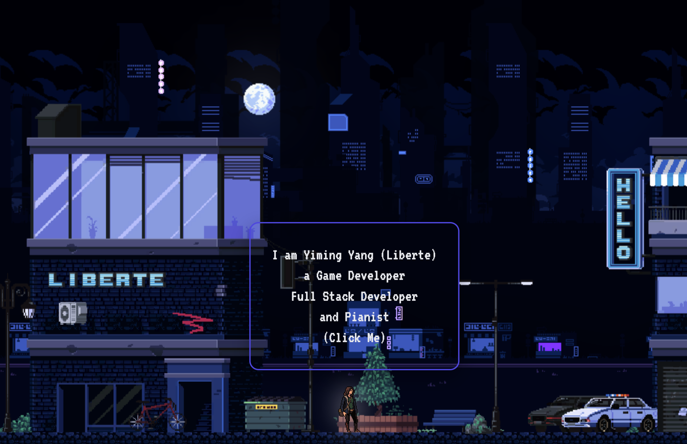

# My Portfolio

Interactive full-stack portfolio for Yiming Yang (Liberte), blending software engineering, game-inspired UI, music showcase, and authenticated testimonials.

[Live Site](https://www.liberteii.com) · [GitHub](https://github.com/LiberteI/My_Portfolio) · [LinkedIn](https://www.linkedin.com/in/yiming-yang-89a0102a0/) · [Resume PDF](docs/Yiming_Yang_Resume.pdf)




## Recruiter Quick Scan

**Who I am:** Yiming Yang (Liberte), Computer Science student and full-stack developer with strong interests in interactive web experiences, game development, graphics, and music.

**Core skills:** JavaScript, TypeScript, React, Node.js, Express, MongoDB, C++, OpenGL, Unity, Java, Python, Tailwind CSS, CSS, Git, Postman, n8n

**Standout work:**
- Built a gamified personal portfolio with layered parallax scenes, animated homepage NPC interactions, contact automation, and social/testimonial flows.
- Shipped a modular YouTube integration for music content with a separate design doc and layered backend architecture.
- Implemented authenticated testimonials using Google and LinkedIn sign-in, moderated publishing, and shared user identity handling.

**Availability/status:** Portfolio is actively maintained and open for software, interactive media, and creative technology opportunities.

**Location:** Halifax, Nova Scotia, Canada

**Fastest contact:** **[liberteix@gmail.com](mailto:liberteix@gmail.com)** · **[LinkedIn](https://www.linkedin.com/in/yiming-yang-89a0102a0/)**

**Resume:** [Direct PDF](docs/Yiming_Yang_Resume.pdf)

## What It Is

This repository powers my personal portfolio site for recruiters, collaborators, and anyone reviewing my engineering work. It showcases software projects, game and graphics work, music performances, personal background, and contact/testimonial flows in one place.

Current sections and routes:
- `/` - Home scene, About, Testimonial
- `/projects` - Project showcase
- `/projects/knight-of-cinders` - Featured game detail page
- `/music` - Arrangements, practice, and performance content
- `/experience` - Experience page
- `/contact` - Contact form and direct contact methods
- `/comment-form` - Authenticated testimonial submission

## Tech Stack

- Frontend: React 19, React Router, Vite
- Styling: page-level CSS plus targeted Tailwind utility usage on the music experience
- Backend: Node.js, Express, cookie-parser, CORS
- Database: MongoDB via Mongoose
- Auth: Google OAuth, LinkedIn OAuth
- Integrations: YouTube Data API, Resend email delivery
- Hosting/deployment: Vercel for the frontend, deployed backend at `https://api.liberteii.com`

## Features

- Gamified homepage with layered parallax skyline and animated homepage NPC
- Responsive navigation with expandable hamburger menu
- About section with scannable tech stack visuals
- Project gallery covering software, game development, graphics, and machine learning work
- Music page backed by YouTube content feeds for arrangements and performances
- Contact form that sends email notifications through Resend
- Authenticated and moderated testimonial flow with Google and LinkedIn sign-in
- Dedicated project detail route for Knight of Cinders with trailer and downloadable build

## Design And Engineering Notes

- The homepage is intentionally built like a scene instead of a standard hero section. Fixed-size layered assets are cropped by the viewport rather than responsively shrunk, which keeps the retro-game composition stable across screen sizes.
- The YouTube module is structured as `route -> controller -> service -> client/config/mapper`, documented in [backend/Youtube/DESIGN.md](backend/Youtube/DESIGN.md). That separation keeps API concerns, config, mapping, and transport logic from bleeding into each other.
- Authentication and testimonials are treated as real product features rather than static portfolio filler. Users can authenticate, submit comments, and see moderated results, while admin workflows stay separate from public display.
- The frontend uses a mixed styling approach on purpose: traditional CSS for highly custom scene composition and Tailwind utilities where dense layout composition improves speed on the music page.
- The site is built for desktop and mobile review. Navigation is explicitly toggle-driven, major scenes use fixed visual anchors, and pages are routable so portfolio sections can be linked directly.

## Getting Started

### Prerequisites

- Node.js 18+
- npm 9+
- MongoDB connection string
- Google OAuth application
- LinkedIn OAuth application
- Resend API key
- YouTube Data API key

### Install

```bash
git clone https://github.com/LiberteI/My_Portfolio.git
cd My_Portfolio
npm install --prefix frontend
npm install --prefix backend
```

### Environment Variables

Create these files before running locally:

- `frontend/.env`
- `backend/.env`

Templates are included here:

- [frontend/.env.example](frontend/.env.example)
- [backend/.env.example](backend/.env.example)

### Run Locally

Frontend:

```bash
cd frontend
npm run dev
```

Runs on Vite's default local port, typically `http://localhost:5173`.

Backend:

```bash
cd backend
npm start
```

Runs on `http://localhost:8080` unless `PORT` is overridden.

### Build

Frontend production build:

```bash
cd frontend
npm run build
```

Frontend preview:

```bash
cd frontend
npm run preview
```

Backend production start:

```bash
cd backend
npm start
```

## Project Structure

```text
.
├── backend/
│   ├── Comment/              # testimonial routes and controller logic
│   ├── CRUD/                 # data access helpers for users/comments
│   ├── DatabaseModel/        # mongoose schemas
│   ├── Middleware/           # auth middleware
│   ├── ThirdParty/           # Google + LinkedIn OAuth handlers
│   ├── Youtube/              # YouTube module and design doc
│   ├── contact/              # contact form email endpoint
│   ├── User/                 # current user endpoint
│   ├── .env.example
│   └── server.js             # Express entry point
├── docs/
│   └── 
├── frontend/
│   ├── public/               # static assets, images, videos
│   ├── src/
│   │   ├── Components/       # reusable UI pieces like Navbar and HomepageNpc
│   │   ├── Pages/            # route-level screens and page sections
│   │   ├── assets/           # imported animations and thumbnails
│   │   ├── App.jsx           # route composition
│   │   └── main.jsx          # React entry point
│   ├── .env.example
│   └── vercel.json           # SPA rewrite config
└── README.md
```

Content in this portfolio is code-driven rather than CMS-driven. Projects, homepage layers, music integrations, and interactive behaviors are defined directly in the React and backend source.

## Roadmap

- Add stronger content management for projects and music items instead of hardcoding arrays and route-level content
- Expand documentation around admin/testimonial flows and deployment setup
- Add automated tests for backend integrations and critical frontend flows
- Continue polishing homepage scene composition, animation control, and mobile ergonomics

## Contact

- Live site: [liberteii.com](https://www.liberteii.com)
- Email: [liberteix@gmail.com](mailto:liberteix@gmail.com)
- Student email: [yn265022@dal.ca](mailto:yn265022@dal.ca)
- LinkedIn: [Yiming Yang](https://www.linkedin.com/in/yiming-yang-89a0102a0/)
- GitHub: [LiberteI](https://github.com/LiberteI)

## License

This repository is released under the ISC License. See [LICENSE](LICENSE).
