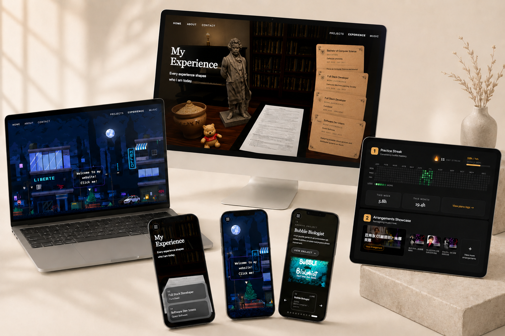

# My Portfolio

## What This Project Is About

Interactive personal portfolio site built to showcase my software projects, engineering style, creative work, and professional background in one place.

[Technical README](Technical-README.md)

### Live Links

- Live demo: [liberteii.com](https://www.liberteii.com)
- Resume: [Resume PDF](docs/YimingYang_CV_S.pdf)
- GitHub: [LiberteI/My_Portfolio](https://github.com/LiberteI/My_Portfolio)
- LinkedIn: [Yiming Yang](https://www.linkedin.com/in/yiming-yang-89a0102a0/)

## Introduction

### Who I Am

Yiming Yang (Liberte) is a Computer Science student and software developer focused on full-stack development, interactive frontend systems, graphics-inspired interfaces, and developer-minded product building.

### My Role In This Project

I designed and built this portfolio as an end-to-end personal product, covering frontend implementation, backend APIs, authentication flows, project presentation, performance optimization, deployment, and technical documentation.

### Contact

- Email: [liberteix@gmail.com](mailto:liberteix@gmail.com)
- Student email: [yn265022@dal.ca](mailto:yn265022@dal.ca)
- LinkedIn: [Yiming Yang](https://www.linkedin.com/in/yiming-yang-89a0102a0/)

## HR Quick Scan

### Standout Outcomes

- Built and deployed a full-stack portfolio that combines interactive UI, backend APIs, third-party integrations, and production hosting.
- Implemented authenticated testimonial flows with moderated publishing using Google and LinkedIn sign-in.
- Structured music and portfolio content into dedicated routes and reusable presentation systems for recruiter-friendly review.
- Built custom visual experiences instead of using a template-driven portfolio layout.
- Added static asset optimization workflows that significantly reduced image payloads for better loading performance.
